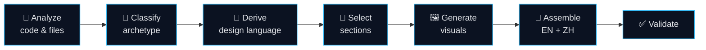

<a id="readme-top"></a>
<div align="right"><a href="./README.md">English</a> | <a href="./README.zh-CN.md">简体中文</a></div>

<div align="center">


<h1>README Architect</h1>

<p><em>Point it at a codebase — get a personalized, style-matched, <strong>bilingual</strong> README.</em></p>

<p>
  <a href="https://github.com/ChrysFu-FndVent/readme-architect/stargazers"></a>
  <a href="./LICENSE"></a>
  
  
  
  
</p>

<p>
  <a href="#about">About</a> ·
  <a href="#features">Features</a> ·
  <a href="#how-it-works">How it works</a> ·
  <a href="#getting-started">Getting Started</a> ·
  <a href="#usage">Usage</a>
</p>

</div>

> [!NOTE]
> **Meta moment:** this very README was drafted by the skill itself — analyzed as a developer tool,
> given a *blueprint* design language, and rendered with a generated hero banner and a real **draw.io**
> architecture diagram. It is the skill eating its own dog food. 🐕

<table>
<tr><td>

**At a glance**

</td><td>

| | |
|---|---|
| **Type** | Agent Skill (developer tool) |
| **Language** | Python 3.8+ · standard library only |
| **Output** | `README.md` (EN) + `README.zh-CN.md` (中文) |
| **Runs on** | macOS · Linux · Windows |
| **Dependencies** | none required — visual skills are optional |

</td></tr>
</table>

<details>
<summary>📑 Table of Contents</summary>

- [✨ About](#about)
- [🎯 Features](#features)
- [⚙️ How it works](#how-it-works)
- [🏗️ Architecture](#architecture)
- [🧩 Archetypes](#archetypes)
- [🎨 Personalization toolkit](#personalization)
- [🖼️ Visual integration](#visuals)
- [📂 Project structure](#structure)
- [🚀 Getting Started](#getting-started)
- [💡 Usage](#usage)
- [📋 Requirements](#requirements)
- [🗺️ Roadmap](#roadmap)
- [🤝 Contributing](#contributing)
- [📄 License](#license)
- [🙏 Acknowledgments](#acknowledgments)

</details>

---

<a id="about"></a>

## ✨ About

**README Architect** is an [Agent Skill](https://docs.anthropic.com) for Qoder / Claude that reads a
project's real code and files and writes a README that looks **hand-crafted for that specific
project** — not a generic fill-in-the-blanks template.

It runs **fully automatically**: analyze → classify → derive a design language → pick sections →
generate visuals → assemble a bilingual README → validate. The result is an English `README.md`
plus a Chinese `README.zh-CN.md`, with layout, badges, tone, and illustrations chosen to fit *this*
repository.

> [!TIP]
> The whole point is **fit**. A lean library gets a dense, information-first README; a web app gets a
> centered hero with a banner and feature grid. Both are driven by evidence found in the code.

<a id="features"></a>

## 🎯 Features

- 🔍 **Evidence-based analysis** — a stdlib-only Python analyzer extracts languages, package managers,
  frameworks, entrypoints, scripts, CI, license, and the git remote. No feature is ever invented.
- 🧩 **Archetype detection** — classifies the repo as `library`, `cli-tool`, `web-app`, `framework`,
  `ml-ai`, `monorepo`, or `minimal`, then adapts layout, sections, and tone.
- 🎨 **Per-project design language** — derives palette, personality, and motifs from the real project
  and lets them drive **both** the layout styling **and** every image-generation prompt.
- 🌐 **Bilingual by default** — parallel `README.md` (English) + `README.zh-CN.md` (中文) with a
  language switch at the top of each.
- 🖼️ **Optional AI visuals** — architecture/flow diagrams and AI-generated banners, wired to the
  `drawio`, `nano-banana-pro` → `nano-banana-flash` → `generate-gpt-image-2` chain, with graceful
  fallback at every step (down to a native Mermaid diagram).
- 🖥️ **Portable, not machine-specific** — detects tools, credentials, and skill install roots on
  *the current* machine (macOS / Linux / Windows); runs the same on someone else's setup and API keys.
- 🧰 **9-technique decoration toolkit** — badges, aligned HTML blocks, dividers, tasteful emoji,
  collapsible `<details>`, tables, live data cards, `> [!NOTE]` callouts, and anchor navigation.
- ✅ **Built-in validator** — checks that anchors resolve, local assets exist, and no template
  placeholders leak into the output.

<a id="how-it-works"></a>

## ⚙️ How it works

A single, fully-automatic pipeline turns a codebase into a finished, validated README:



The archetype sets the **skeleton**; the project's own design language sets the **skin**. That
separation is what makes each README feel bespoke rather than templated.

<p align="right"><a href="#readme-top">↑ back to top</a></p>

<a id="architecture"></a>

## 🏗️ Architecture

One stdlib orchestrator drives the pipeline, reads from bundled references/templates, and calls
companion skills **only when they're detected** — each with a graceful fallback — to emit both READMEs.

<div align="center">


</div>

> [!TIP]
> This diagram is itself a **draw.io** export produced by the skill on this machine. Where draw.io
> isn't installed, the same logic renders a native Mermaid block instead — no binary required.

<p align="right"><a href="#readme-top">↑ back to top</a></p>

<a id="archetypes"></a>

## 🧩 Archetypes

| Archetype | Detected from | Layout | Default visuals |
|-----------|---------------|--------|-----------------|
| `library` | public API, published package, no app entry | classic, dense | optional logo |
| `cli-tool` | `bin` field, argparse/click/cobra/commander | compact, left | flowchart |
| `web-app` | React/Vue/Next/Django/Rails app, deploy config | centered hero | banner + architecture |
| `framework` | large dev tool, plugin ecosystem, strong brand | branded hero | banner + logo + diagram |
| `ml-ai` | notebooks, torch/tf/transformers, datasets, paper | research-oriented | pipeline diagram |
| `monorepo` | pnpm/yarn/nx/turbo/cargo workspaces | packages table | module map |
| `minimal` | tiny config/docs-only repo | lean, single-column | none |

<a id="personalization"></a>

## 🎨 Personalization toolkit

The nine decoration techniques the skill applies — **dialed to the project's tone**, never stacked
blindly (lean for libraries, rich for web-apps/frameworks):

| # | Technique | # | Technique |
|---|-----------|---|-----------|
| 1 | Badge decoration (static & dynamic) | 6 | Comparison / parameter tables |
| 2 | Centered titles & decorative dividers | 7 | Live data cards (stars, stats) |
| 3 | Flexible alignment & multi-column layout | 8 | `> [!NOTE]` callouts & code highlighting |
| 4 | Tasteful per-section emoji | 9 | Anchor-navigation table of contents |
| 5 | Collapsible `<details>` blocks | | |

<a id="visuals"></a>

## 🖼️ Visual integration

Visuals are generated **only when they help**, and every prompt is derived from the project's design
language — never generic clip-art.

| Asset | Tool | When |
|-------|------|------|
| Architecture / flow / sequence diagram | [`drawio`](https://www.drawio.com) → native **Mermaid** fallback | multi-component systems, pipelines |
| Banner / logo / illustration | [`nano-banana-pro`](https://github.com/ChrysFu-FndVent) → [`nano-banana-flash`](https://github.com/ChrysFu-FndVent) → [`generate-gpt-image-2`](https://github.com/ChrysFu-FndVent) | strong branding, no banner exists |

> [!WARNING]
> The skill **never fabricates product screenshots or fake metrics.** Real screenshots are used only
> if they already exist in the repo; image generation is limited to banners, logos, and abstract art.
> If a generator or its credentials are unavailable, the README degrades gracefully down the chain
> (and diagrams fall back to native Mermaid), always noting any omission.

<a id="structure"></a>

## 📂 Project structure

<details>
<summary>Show the layout</summary>

```text
readme-architect/
├── SKILL.md                    # orchestration & 7-step workflow
├── references/
│   ├── section-library.md      # sections, ordering, when to include
│   ├── style-archetypes.md     # archetype → layout/tone/badge/section presets
│   ├── badges.md               # shields.io badge catalog
│   ├── decoration-toolkit.md   # the 9 personalization techniques
│   └── visual-assets.md        # drawio / nano-banana-pro / gpt-image-2 integration
├── templates/                  # per-archetype README skeletons
├── scripts/
│   ├── analyze_project.py      # repo → profile.json (stdlib only)
│   ├── check_integrations.py    # detect drawio / image skills / creds (any OS)
│   └── validate_readme.py      # anchors / links / placeholders check
└── assets/readme/              # generated banner & architecture diagram
```

</details>

Reference files worth reading: [SKILL.md](SKILL.md) ·
[section-library](references/section-library.md) ·
[style-archetypes](references/style-archetypes.md) ·
[decoration-toolkit](references/decoration-toolkit.md) ·
[visual-assets](references/visual-assets.md).

<a id="getting-started"></a>

## 🚀 Getting Started

Copy the `readme-architect/` folder into your agent's skills directory:

```bash
# Qoder
cp -r readme-architect ~/.qoder/skills/

# Claude
cp -r readme-architect ~/.claude/skills/
```

That's it — the skill is discovered automatically the next time your agent loads its skills.

<a id="usage"></a>

## 💡 Usage

Open any project and ask your agent:

```text
Generate a README for this project.
```

The skill takes over from there. You can also run the helper scripts directly:

```bash
# 1. Analyze a repo into a structured profile
python3 scripts/analyze_project.py --root . --out .readme-architect/profile.json

# 2. Validate a finished README
python3 scripts/validate_readme.py README.md
```

> [!TIP]
> If a substantive hand-written `README.md` already exists, the skill writes to
> `README.generated.md` instead of silently overwriting your work — unless you explicitly ask it to
> replace the original.

<p align="right"><a href="#readme-top">↑ back to top</a></p>

<a id="requirements"></a>

## 📋 Requirements

- **Python 3.8+** — the analyzer and validator use only the standard library (no `pip install`).
- **Optional:** the `drawio`, `nano-banana-pro`, `nano-banana-flash`, or `generate-gpt-image-2` skills
  for visuals. The README renders fine without them (diagrams fall back to Mermaid).
- **Any OS.** Detection is portable across macOS / Linux / Windows; run
  `python3 scripts/check_integrations.py` to see what's available on your machine. Extend skill search
  paths with `README_ARCHITECT_SKILL_ROOTS` if your skills live elsewhere.

<a id="roadmap"></a>

## 🗺️ Roadmap

- [ ] More archetypes (mobile apps, browser extensions, game projects).
- [ ] Additional output languages beyond English and Chinese.
- [ ] Richer analyzer signals (test coverage, bundle size, dependency graph).
- [ ] A gallery of example READMEs generated per archetype.

<a id="contributing"></a>

## 🤝 Contributing

Contributions are welcome. Open an issue to discuss a change, or send a pull request. When adding a
new archetype or decoration technique, please keep the *evidence-over-invention* rule intact.

<a id="license"></a>

## 📄 License

Distributed under the **MIT License**. See [`LICENSE`](LICENSE) for details.

<a id="acknowledgments"></a>

## 🙏 Acknowledgments

- [standard-readme](https://github.com/RichardLitt/standard-readme) — section ordering conventions.
- [Best-README-Template](https://github.com/othneildrew/Best-README-Template) — centered-hero inspiration.
- [Shields.io](https://shields.io) — the badges.
- [Mermaid](https://mermaid.js.org) — native diagrams that render on GitHub.

<div align="center">

Built with the **README Architect** skill · banner by `gpt-image-2` · diagram by `draw.io`

<a href="https://star-history.com/#ChrysFu-FndVent/readme-architect&Date"></a>

</div>
