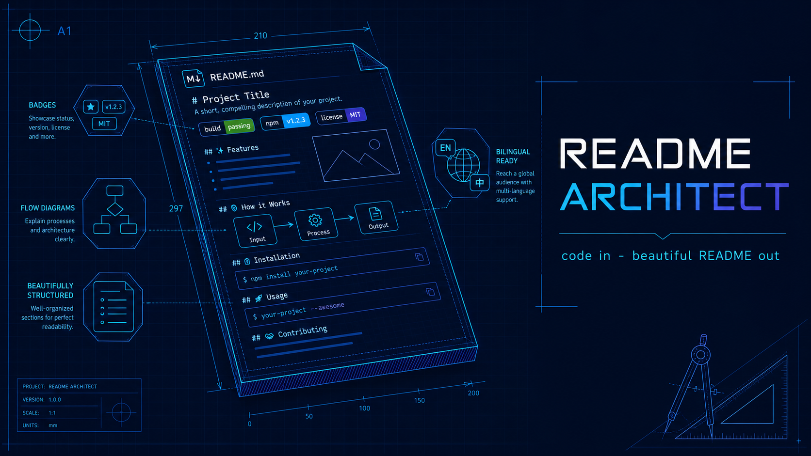
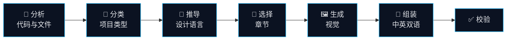
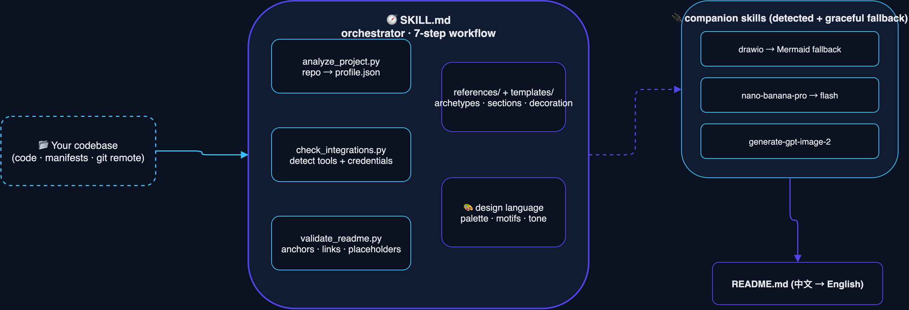
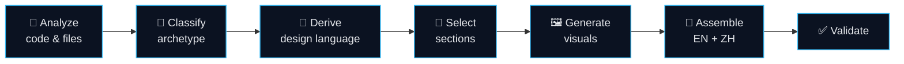

<a id="readme-top"></a>
<div align="right"><a href="#简体中文">简体中文</a> | <a href="#english">English</a></div>

<div align="center">



<h1>README Architect</h1>

<p><em>Point it at a codebase — get a personalized, style-matched, <strong>bilingual</strong> README.</em></p>

<p>
  <a href="https://github.com/ChrysFu-FndVent/readme-architect/stargazers"></a>
  <a href="./LICENSE"></a>
  
  
  
  
</p>

</div>

<a id="简体中文"></a>

> [!NOTE]
> **有意思的是：** 这份 README 正是由该技能自己生成的 —— 它把自己识别为一个开发者工具，赋予其
> *蓝图（blueprint）* 设计语言，并配上一张生成的主视觉横幅和一张真正的 **draw.io** 架构图。
> 这就是技能“自己吃自己的狗粮”。🐕

<table>
<tr><td>

**一眼概览**

</td><td>

| | |
|---|---|
| **类型** | Agent Skill（开发者工具） |
| **语言** | Python 3.8+ · 仅标准库 |
| **产物** | 单个 `README.md`（中文正文在前，英文正文在后） |
| **运行于** | macOS · Linux · Windows |
| **依赖** | 无强制依赖 —— 视觉技能均为可选 |

</td></tr>
</table>

<details>
<summary>📑 目录 · Table of Contents</summary>

- [✨ 简介](#zh-about)
- [🎯 特性](#zh-features)
- [⚙️ 工作原理](#zh-how-it-works)
- [🏗️ 架构](#zh-architecture)
- [🧩 项目类型（Archetype）](#zh-archetypes)
- [🎨 个性化装饰工具箱](#zh-personalization)
- [🖼️ 视觉联动](#zh-visuals)
- [📂 项目结构](#zh-structure)
- [🚀 快速开始](#zh-getting-started)
- [💡 使用方法](#zh-usage)
- [📋 环境要求](#zh-requirements)
- [🗺️ 路线图](#zh-roadmap)
- [🤝 参与贡献](#zh-contributing)
- [📄 许可证](#zh-license)
- [🙏 致谢](#zh-acknowledgments)

</details>

---

<a id="zh-about"></a>

## ✨ 简介

**README Architect** 是一个面向 Qoder / Claude 的 [Agent Skill](https://docs.anthropic.com)，它读取项目
真实的代码与文件，写出一份**看起来是为该项目手工打磨**的 README —— 而不是通用的填空模板。

它**全自动**运行：分析 → 分类 → 推导设计语言 → 挑选章节 → 生成视觉 → 组装双语 README → 校验。
产物是一个 `README.md`：标题和短简介仅使用英文，完整中文正文在前，完整英文正文在后；两部分的排版、徽章、
语气与插图都为**当前这个仓库**量身选择。

> [!TIP]
> 核心在于**契合**。精简的库会得到信息密集、以内容为先的 README；Web 应用则得到带横幅和功能网格的居中
> 英雄区。两者都由代码中的真实证据驱动。

<a id="zh-features"></a>

## 🎯 特性

- 🔍 **基于证据的分析** —— 纯标准库的 Python 分析器提取语言、包管理器、框架、入口、脚本、CI、许可证以及
  git remote。绝不臆造任何特性。
- 🧩 **项目类型识别** —— 将仓库归类为 `library`、`cli-tool`、`web-app`、`framework`、`ml-ai`、
  `monorepo` 或 `minimal`，并据此调整排版、章节与语气。
- 🎨 **按项目定制的设计语言** —— 从真实项目中推导调色板、性格与意象，让它们**同时**驱动排版风格**和**每一个
  配图生成提示词。
- 🌐 **默认双语** —— 单个 `README.md` 中完整中文正文在前、英文正文在后，标题和短简介只出现英文版一次。
- 🖼️ **可选 AI 视觉** —— 架构/流程图与 AI 生成横幅，联动 `drawio`、`nano-banana-pro` →
  `nano-banana-flash` → `generate-gpt-image-2` 链路，每一级都具备优雅降级（最终降到原生 Mermaid 图）。
- 🖥️ **可移植，不绑定单机** —— 在*当前*机器上探测工具、凭据与技能安装路径（macOS / Linux / Windows）；
  换到别人的环境、用别的 API 密钥照样跑通。
- 🧰 **9 项装饰工具箱** —— 徽章、对齐 HTML 块、分割线、恰当的 emoji、可折叠 `<details>`、表格、
  动态数据卡片、`> [!NOTE]` 提示块以及锚点导航。
- ✅ **内置校验器** —— 检查锚点可解析、本地资源存在、无模板占位符残留。

<a id="zh-how-it-works"></a>

## ⚙️ 工作原理

一条全自动流水线，把代码库变成一份成品、已校验的 README：



项目类型决定**骨架**，项目自身的设计语言决定**皮肤**。正是这种分离，让每份 README 都显得量身定制，而非
套模板。

<p align="right"><a href="#readme-top">↑ 回到顶部</a></p>

<a id="zh-architecture"></a>

## 🏗️ 架构

一个纯标准库编排器驱动整条流水线，读取内置的 references/templates，并**仅在探测到时**才调用伴生技能
（每个都有优雅降级），最终产出中英两份 README。

<div align="center">



</div>

> [!TIP]
> 这张图本身就是技能在本机上用 **draw.io** 导出的。当未安装 draw.io 时，同样的逻辑会改用原生
> Mermaid 块渲染 —— 无需任何二进制依赖。

<p align="right"><a href="#readme-top">↑ 回到顶部</a></p>

<a id="zh-archetypes"></a>

## 🧩 项目类型（Archetype）

| 类型 | 识别依据 | 排版 | 默认视觉 |
|------|----------|------|----------|
| `library` | 公开 API、已发布包、无应用入口 | 经典、密集 | 可选 logo |
| `cli-tool` | `bin` 字段、argparse/click/cobra/commander | 紧凑、左对齐 | 流程图 |
| `web-app` | React/Vue/Next/Django/Rails 应用、部署配置 | 居中英雄区 | 横幅 + 架构图 |
| `framework` | 大型开发工具、插件生态、强品牌 | 品牌英雄区 | 横幅 + logo + 图 |
| `ml-ai` | notebook、torch/tf/transformers、数据集、论文 | 研究导向 | 流水线图 |
| `monorepo` | pnpm/yarn/nx/turbo/cargo 工作区 | 包列表表格 | 模块关系图 |
| `minimal` | 极小的配置/纯文档仓库 | 精简、单栏 | 无 |

<a id="zh-personalization"></a>

## 🎨 个性化装饰工具箱

技能会运用的九项装饰技术 —— **依项目语气调校**，绝不盲目堆砌（库精简，Web 应用/框架丰富）：

| # | 技术 | # | 技术 |
|---|------|---|------|
| 1 | 徽章装饰（静态与动态） | 6 | 对比 / 参数表格 |
| 2 | 居中标题与装饰分割线 | 7 | 动态数据卡片（星标、统计） |
| 3 | 灵活对齐与多栏排版 | 8 | `> [!NOTE]` 提示块与代码高亮 |
| 4 | 恰当的分区 emoji | 9 | 锚点导航目录 |
| 5 | 可折叠 `<details>` 详情块 | | |

<a id="zh-visuals"></a>

## 🖼️ 视觉联动

视觉资产**仅在有帮助时**才生成，且每个提示词都从项目的设计语言推导而来 —— 绝非通用素材图。

| 资产 | 工具 | 何时生成 |
|------|------|----------|
| 架构 / 流程 / 时序图 | [`drawio`](https://www.drawio.com) → 原生 **Mermaid** 兜底 | 多组件系统、流水线 |
| 横幅 / logo / 插图 | [`nano-banana-pro`](https://github.com/ChrysFu-FndVent) → [`nano-banana-flash`](https://github.com/ChrysFu-FndVent) → [`generate-gpt-image-2`](https://github.com/ChrysFu-FndVent) | 品牌感强、且尚无横幅 |

> [!WARNING]
> 技能**绝不伪造产品截图或虚假指标。** 只有当仓库里已存在真实截图时才使用；图像生成仅限于横幅、logo 与
> 抽象插画。若生成器或其凭据不可用，README 会沿链路优雅降级（图表降到原生 Mermaid），并始终标注任何省略。

<a id="zh-structure"></a>

## 📂 项目结构

<details>
<summary>展开查看结构</summary>

```text
readme-architect/
├── SKILL.md                    # 编排与 7 步工作流
├── references/
│   ├── section-library.md      # 章节、排序、取舍规则
│   ├── style-archetypes.md     # 项目类型 → 排版/语气/徽章/章节预设
│   ├── badges.md               # shields.io 徽章目录
│   ├── decoration-toolkit.md   # 9 项个性化技术
│   └── visual-assets.md        # drawio / nano-banana-pro / gpt-image-2 联动
├── templates/                  # 各项目类型的 README 骨架
├── scripts/
│   ├── analyze_project.py      # 仓库 → profile.json（纯标准库）
│   ├── check_integrations.py    # 探测 drawio / 图像技能 / 凭据（任意系统）
│   └── validate_readme.py      # 锚点 / 链接 / 占位符校验
└── assets/readme/              # 生成的横幅与架构图
```

</details>

值得一读的参考文件：[SKILL.md](SKILL.md) ·
[section-library](references/section-library.md) ·
[style-archetypes](references/style-archetypes.md) ·
[decoration-toolkit](references/decoration-toolkit.md) ·
[visual-assets](references/visual-assets.md)。

<a id="zh-getting-started"></a>

## 🚀 快速开始

把 `readme-architect/` 文件夹复制到你的 agent 技能目录：

```bash
# Qoder
cp -r readme-architect ~/.qoder/skills/

# Claude
cp -r readme-architect ~/.claude/skills/
```

就这么简单 —— 下次 agent 加载技能时会自动发现它。

<a id="zh-usage"></a>

## 💡 使用方法

打开任意项目，对你的 agent 说：

```text
为这个项目生成一份 README。
```

技能会接管后续工作。你也可以直接运行辅助脚本：

```bash
# 1. 把仓库分析成结构化 profile
python3 scripts/analyze_project.py --root . --out .readme-architect/profile.json

# 2. 校验一份完成的 README
python3 scripts/validate_readme.py README.md
```

> [!TIP]
> 如果已存在一份实质性的手写 `README.md`，技能会写入 `README.generated.md` 而不会静默覆盖你的成果 ——
> 除非你明确要求替换原文件。

<p align="right"><a href="#readme-top">↑ 回到顶部</a></p>

<a id="zh-requirements"></a>

## 📋 环境要求

- **Python 3.8+** —— 分析器与校验器只用标准库（无需 `pip install`）。
- **可选：** `drawio`、`nano-banana-pro`、`nano-banana-flash` 或 `generate-gpt-image-2` 技能用于视觉。
  没有它们，README 依然能正常渲染（图表降级为 Mermaid）。
- **任意系统。** 探测逻辑可跨 macOS / Linux / Windows 移植；运行
  `python3 scripts/check_integrations.py` 即可查看本机可用能力。若你的技能装在其他位置，可用
  `README_ARCHITECT_SKILL_ROOTS` 扩展技能搜索路径。

<a id="zh-roadmap"></a>

## 🗺️ 路线图

- [ ] 更多项目类型（移动应用、浏览器扩展、游戏项目）。
- [ ] 英文与中文之外的更多输出语言。
- [ ] 更丰富的分析信号（测试覆盖率、包体积、依赖图）。
- [ ] 各项目类型的示例 README 画廊。

<a id="zh-contributing"></a>

## 🤝 参与贡献

欢迎贡献。可以开一个 issue 讨论改动，或直接发 pull request。在新增项目类型或装饰技术时，请保持
*证据优先于臆造* 的原则。

<a id="zh-license"></a>

## 📄 许可证

基于 **MIT 许可证** 发布。详见 [`LICENSE`](LICENSE)。

<a id="zh-acknowledgments"></a>

## 🙏 致谢

- [standard-readme](https://github.com/RichardLitt/standard-readme) —— 章节排序规范。
- [Best-README-Template](https://github.com/othneildrew/Best-README-Template) —— 居中英雄区灵感。
- [Shields.io](https://shields.io) —— 徽章。
- [Mermaid](https://mermaid.js.org) —— 可在 GitHub 原生渲染的图表。

<a id="english"></a>

> [!NOTE]
> **Meta moment:** this very README was drafted by the skill itself — analyzed as a developer tool,
> given a *blueprint* design language, and rendered with a generated hero banner and a real **draw.io**
> architecture diagram. It is the skill eating its own dog food. 🐕

<table>
<tr><td>

**At a glance**

</td><td>

| | |
|---|---|
| **Type** | Agent Skill (developer tool) |
| **Language** | Python 3.8+ · standard library only |
| **Output** | one `README.md`, Chinese body first and English body second |
| **Runs on** | macOS · Linux · Windows |
| **Dependencies** | none required — visual skills are optional |

</td></tr>
</table>

<details>
<summary>📑 Table of Contents</summary>

- [✨ About](#en-about)
- [🎯 Features](#en-features)
- [⚙️ How it works](#en-how-it-works)
- [🏗️ Architecture](#en-architecture)
- [🧩 Archetypes](#en-archetypes)
- [🎨 Personalization toolkit](#en-personalization)
- [🖼️ Visual integration](#en-visuals)
- [📂 Project structure](#en-structure)
- [🚀 Getting Started](#en-getting-started)
- [💡 Usage](#en-usage)
- [📋 Requirements](#en-requirements)
- [🗺️ Roadmap](#en-roadmap)
- [🤝 Contributing](#en-contributing)
- [📄 License](#en-license)
- [🙏 Acknowledgments](#en-acknowledgments)

</details>

---

<a id="en-about"></a>

## ✨ About

**README Architect** is an [Agent Skill](https://docs.anthropic.com) for Qoder / Claude that reads a
project's real code and files and writes a README that looks **hand-crafted for that specific
project** — not a generic fill-in-the-blanks template.

It runs **fully automatically**: analyze → classify → derive a design language → pick sections →
generate visuals → assemble a bilingual README → validate. The result is one `README.md`: its title
and short tagline are English-only, then the Chinese body comes before the English body, with layout,
badges, tone, and illustrations chosen to fit *this* repository.

> [!TIP]
> The whole point is **fit**. A lean library gets a dense, information-first README; a web app gets a
> centered hero with a banner and feature grid. Both are driven by evidence found in the code.

<a id="en-features"></a>

## 🎯 Features

- 🔍 **Evidence-based analysis** — a stdlib-only Python analyzer extracts languages, package managers,
  frameworks, entrypoints, scripts, CI, license, and the git remote. No feature is ever invented.
- 🧩 **Archetype detection** — classifies the repo as `library`, `cli-tool`, `web-app`, `framework`,
  `ml-ai`, `monorepo`, or `minimal`, then adapts layout, sections, and tone.
- 🎨 **Per-project design language** — derives palette, personality, and motifs from the real project
  and lets them drive **both** the layout styling **and** every image-generation prompt.
- 🌐 **Bilingual by default** — one `README.md` with an English-only title and tagline, a Chinese body
  first, and an English body second, linked with anchors at the top.
- 🖼️ **Optional AI visuals** — architecture/flow diagrams and AI-generated banners, wired to the
  `drawio`, `nano-banana-pro` → `nano-banana-flash` → `generate-gpt-image-2` chain, with graceful
  fallback at every step (down to a native Mermaid diagram).
- 🖥️ **Portable, not machine-specific** — detects tools, credentials, and skill install roots on
  *the current* machine (macOS / Linux / Windows); runs the same on someone else's setup and API keys.
- 🧰 **9-technique decoration toolkit** — badges, aligned HTML blocks, dividers, tasteful emoji,
  collapsible `<details>`, tables, live data cards, `> [!NOTE]` callouts, and anchor navigation.
- ✅ **Built-in validator** — checks that anchors resolve, local assets exist, and no template
  placeholders leak into the output.

<a id="en-how-it-works"></a>

## ⚙️ How it works

A single, fully-automatic pipeline turns a codebase into a finished, validated README:



The archetype sets the **skeleton**; the project's own design language sets the **skin**. That
separation is what makes each README feel bespoke rather than templated.

<p align="right"><a href="#readme-top">↑ back to top</a></p>

<a id="en-architecture"></a>

## 🏗️ Architecture

One stdlib orchestrator drives the pipeline, reads from bundled references/templates, and calls
companion skills **only when they're detected** — each with a graceful fallback — to emit both READMEs.

<div align="center">


</div>

> [!TIP]
> This diagram is itself a **draw.io** export produced by the skill on this machine. Where draw.io
> isn't installed, the same logic renders a native Mermaid block instead — no binary required.

<p align="right"><a href="#readme-top">↑ back to top</a></p>

<a id="en-archetypes"></a>

## 🧩 Archetypes

| Archetype | Detected from | Layout | Default visuals |
|-----------|---------------|--------|-----------------|
| `library` | public API, published package, no app entry | classic, dense | optional logo |
| `cli-tool` | `bin` field, argparse/click/cobra/commander | compact, left | flowchart |
| `web-app` | React/Vue/Next/Django/Rails app, deploy config | centered hero | banner + architecture |
| `framework` | large dev tool, plugin ecosystem, strong brand | branded hero | banner + logo + diagram |
| `ml-ai` | notebooks, torch/tf/transformers, datasets, paper | research-oriented | pipeline diagram |
| `monorepo` | pnpm/yarn/nx/turbo/cargo workspaces | packages table | module map |
| `minimal` | tiny config/docs-only repo | lean, single-column | none |

<a id="en-personalization"></a>

## 🎨 Personalization toolkit

The nine decoration techniques the skill applies — **dialed to the project's tone**, never stacked
blindly (lean for libraries, rich for web-apps/frameworks):

| # | Technique | # | Technique |
|---|-----------|---|-----------|
| 1 | Badge decoration (static & dynamic) | 6 | Comparison / parameter tables |
| 2 | Centered titles & decorative dividers | 7 | Live data cards (stars, stats) |
| 3 | Flexible alignment & multi-column layout | 8 | `> [!NOTE]` callouts & code highlighting |
| 4 | Tasteful per-section emoji | 9 | Anchor-navigation table of contents |
| 5 | Collapsible `<details>` blocks | | |

<a id="en-visuals"></a>

## 🖼️ Visual integration

Visuals are generated **only when they help**, and every prompt is derived from the project's design
language — never generic clip-art.

| Asset | Tool | When |
|-------|------|------|
| Architecture / flow / sequence diagram | [`drawio`](https://www.drawio.com) → native **Mermaid** fallback | multi-component systems, pipelines |
| Banner / logo / illustration | [`nano-banana-pro`](https://github.com/ChrysFu-FndVent) → [`nano-banana-flash`](https://github.com/ChrysFu-FndVent) → [`generate-gpt-image-2`](https://github.com/ChrysFu-FndVent) | strong branding, no banner exists |

> [!WARNING]
> The skill **never fabricates product screenshots or fake metrics.** Real screenshots are used only
> if they already exist in the repo; image generation is limited to banners, logos, and abstract art.
> If a generator or its credentials are unavailable, the README degrades gracefully down the chain
> (and diagrams fall back to native Mermaid), always noting any omission.

<a id="en-structure"></a>

## 📂 Project structure

<details>
<summary>Show the layout</summary>

```text
readme-architect/
├── SKILL.md                    # orchestration & 7-step workflow
├── references/
│   ├── section-library.md      # sections, ordering, when to include
│   ├── style-archetypes.md     # archetype → layout/tone/badge/section presets
│   ├── badges.md               # shields.io badge catalog
│   ├── decoration-toolkit.md   # the 9 personalization techniques
│   └── visual-assets.md        # drawio / nano-banana-pro / gpt-image-2 integration
├── templates/                  # per-archetype README skeletons
├── scripts/
│   ├── analyze_project.py      # repo → profile.json (stdlib only)
│   ├── check_integrations.py    # detect drawio / image skills / creds (any OS)
│   └── validate_readme.py      # anchors / links / placeholders check
└── assets/readme/              # generated banner & architecture diagram
```

</details>

Reference files worth reading: [SKILL.md](SKILL.md) ·
[section-library](references/section-library.md) ·
[style-archetypes](references/style-archetypes.md) ·
[decoration-toolkit](references/decoration-toolkit.md) ·
[visual-assets](references/visual-assets.md).

<a id="en-getting-started"></a>

## 🚀 Getting Started

Copy the `readme-architect/` folder into your agent's skills directory:

```bash
# Qoder
cp -r readme-architect ~/.qoder/skills/

# Claude
cp -r readme-architect ~/.claude/skills/
```

That's it — the skill is discovered automatically the next time your agent loads its skills.

<a id="en-usage"></a>

## 💡 Usage

Open any project and ask your agent:

```text
Generate a README for this project.
```

The skill takes over from there. You can also run the helper scripts directly:

```bash
# 1. Analyze a repo into a structured profile
python3 scripts/analyze_project.py --root . --out .readme-architect/profile.json

# 2. Validate a finished README
python3 scripts/validate_readme.py README.md
```

> [!TIP]
> If a substantive hand-written `README.md` already exists, the skill writes to
> `README.generated.md` instead of silently overwriting your work — unless you explicitly ask it to
> replace the original.

<p align="right"><a href="#readme-top">↑ back to top</a></p>

<a id="en-requirements"></a>

## 📋 Requirements

- **Python 3.8+** — the analyzer and validator use only the standard library (no `pip install`).
- **Optional:** the `drawio`, `nano-banana-pro`, `nano-banana-flash`, or `generate-gpt-image-2` skills
  for visuals. The README renders fine without them (diagrams fall back to Mermaid).
- **Any OS.** Detection is portable across macOS / Linux / Windows; run
  `python3 scripts/check_integrations.py` to see what's available on your machine. Extend skill search
  paths with `README_ARCHITECT_SKILL_ROOTS` if your skills live elsewhere.

<a id="en-roadmap"></a>

## 🗺️ Roadmap

- [ ] More archetypes (mobile apps, browser extensions, game projects).
- [ ] Additional output languages beyond English and Chinese.
- [ ] Richer analyzer signals (test coverage, bundle size, dependency graph).
- [ ] A gallery of example READMEs generated per archetype.

<a id="en-contributing"></a>

## 🤝 Contributing

Contributions are welcome. Open an issue to discuss a change, or send a pull request. When adding a
new archetype or decoration technique, please keep the *evidence-over-invention* rule intact.

<a id="en-license"></a>

## 📄 License

Distributed under the **MIT License**. See [`LICENSE`](LICENSE) for details.

<a id="en-acknowledgments"></a>

## 🙏 Acknowledgments

- [standard-readme](https://github.com/RichardLitt/standard-readme) — section ordering conventions.
- [Best-README-Template](https://github.com/othneildrew/Best-README-Template) — centered-hero inspiration.
- [Shields.io](https://shields.io) — the badges.
- [Mermaid](https://mermaid.js.org) — native diagrams that render on GitHub.
