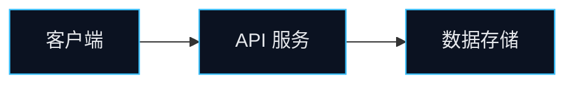

# Bilingual Architecture Diagrams

Use this process whenever a README needs an architecture, workflow, sequence, data-flow, or module
map in both Chinese and English. The goal is one faithful model rendered twice, not two independently
invented diagrams.

## Build the Evidence Map

Before drawing, record only components and edges that are visible in manifests, source modules,
configuration, deployment files, or existing docs:

| Field | Record |
|---|---|
| Nodes | real services, packages, clients, stores, queues, models, or external systems |
| Edges | actual request, event, data, dependency, or control-flow direction |
| Boundaries | runtime, deployment, trust, or package boundary when supported by files |
| Labels | Chinese and English names for the same node; keep product names and code identifiers unchanged |

Do not infer a database, cloud provider, authentication layer, human reviewer, or deployment stage
from an archetype or a presentation signal alone.

## Layout Rules

1. Choose one question per diagram: system architecture, request flow, async workflow, data/ML
   pipeline, sequence, or module dependency. Use a second diagram only when it answers a different
   documented question.
2. Prefer 4-8 primary nodes. Group supporting modules in a labelled boundary instead of drawing every
   file. Split a dense system rather than shrinking text below readability.
3. Use a stable direction: left-to-right for requests/pipelines, top-to-bottom for hierarchy, and
   swimlanes for handoffs. Arrows must carry the real action or payload when it clarifies meaning.
4. Use one accent palette, high contrast, a consistent node shape per entity type, and a small legend
   only when symbols would otherwise be ambiguous. Decorative arrows, gradients, and generic clouds
   reduce clarity.
5. Keep both language versions topologically identical: same nodes, grouping, arrows, and assets;
   localize human-readable labels only. Use `architecture-zh.png` and `architecture-en.png`, or two
   localized Mermaid blocks. Embed the Chinese version only in the Chinese Architecture section and
   the English version only in the English section.

## Rendering and Review

- Prefer draw.io when available. Export at 2x or higher and inspect at the rendered README width.
  Retain the editable `.drawio` source alongside exports when the project accepts generated assets.
- Use Mermaid when draw.io is unavailable. Keep the node count small and define an accessible
  `classDef`; do not put bilingual labels into one cramped node.
- Before embedding, compare both diagrams against the evidence map: every node and arrow must exist
  in both versions, labels must fit, arrows must terminate clearly, and no text may be cut off.
- Add 1-3 sentences below each diagram explaining the documented flow. Diagram labels do not replace
  installation, configuration, or security documentation.

## Mermaid Pair Pattern

