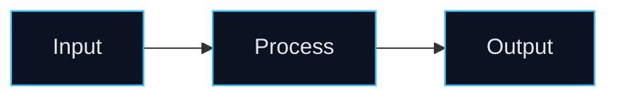

# Visual Assets

How to decide on, generate, and embed images/diagrams — always **derived from the project's real
design language** (Step 2b), never generic clip-art. Save everything under
`<project-root>/assets/readme/` and embed with relative paths and descriptive alt text.

Before calling any generator skill, open its own `SKILL.md` and follow its exact invocation and
flags. Retry a failing call at most once, then degrade gracefully and note the omission.

**Detect availability first.** Run `python3 <skill-dir>/scripts/check_integrations.py [--json]` to see
which image routes are `usable_now`, whether drawio is reachable (PATH or macOS app bundle), and
which credentials are present. Use its **preferred banner route** and fall through the chains below
rather than guessing.

---

## Decision matrix

| Asset | Tool | Generate when | Skip when |
|---|---|---|---|
| Architecture diagram | `drawio` | multi-component system, services, multi-module data flow | single-file/trivial project |
| Flowchart | `drawio` | CLI/pipeline/step process worth showing | no meaningful flow |
| Sequence / ERD / class | `drawio` | request lifecycle / DB schema / core class model is central | not central to understanding |
| Banner (hero) | `nano-banana-pro` → `nano-banana-flash` → `generate-gpt-image-2` | web-app / framework, or strong brand & no banner exists | lean library/minimal, or a banner already exists |
| Logo | `nano-banana-pro` → `nano-banana-flash` → `generate-gpt-image-2` | no logo exists and archetype benefits from branding | a logo already exists |
| Divider / motif strip | `nano-banana-pro` → `nano-banana-flash` → `generate-gpt-image-2` | rich layout wants section separators | lean layouts |
| Screenshots / demo GIF | none (use real files) | the repo already contains them | — never synthesize fake UI |

**Do not fabricate product screenshots or fake metrics.** Image generation is for banners, logos,
abstract illustrations, and decorative dividers only.

---

## Deriving prompts from the project (mandatory)

Every image prompt must be built from the design brief (domain, personality, palette, motifs, tech
identity) — not from a fixed template. Compose the prompt from these slots:

```
<asset type> for a <domain> <archetype> named "<name>".
Subject/metaphor: <motif drawn from real project concepts>.
Style: <personality-driven art style: e.g. flat vector / isometric tech / minimal line / playful 3D>.
Color palette: <real or domain-fitting hex colors>, consistent with the project brand.
Composition: <banner 16:9 wide with title space / square logo / thin horizontal divider>.
Mood: <e.g. trustworthy & clinical for health; energetic for consumer; precise for dev tools>.
No text unless the project name is requested; no watermark; transparent or <bg> background.
```

Personality → art-style guidance:
- **enterprise / fintech / health** → clean flat vector or subtle isometric, restrained palette,
  professional. (e.g. an elderly-care smart-wristband project → soft, trustworthy blues/greens,
  wristband + heartbeat/data motifs.)
- **developer tool / framework** → geometric, modern, high-contrast accent on neutral, iconographic.
- **playful / consumer** → rounded, vibrant, friendly 3D or sticker style.
- **research / ML** → schematic, diagrammatic, muted palette, emphasis on pipeline/data.
- **minimalist** → single-accent line art, lots of whitespace.

Keep the **same palette and style** across banner, logo, dividers, and the diagram accent color so
the README reads as one designed system.

---

## drawio (diagrams)

1. Pick the diagram type from the project: architecture (services/modules), flowchart (CLI/pipeline),
   sequence (request lifecycle), ERD (DB schema), class (core model).
2. Build node/edge content from **real components** found in Step 1 (actual service names, modules,
   data stores, external APIs) — not placeholder boxes.
3. Apply the project's accent color to headers/highlights for visual consistency with the banner.
4. Export PNG and embed it under the Architecture section. The drawio CLI is often **not on PATH**;
   `check_integrations.py` reports the working invocation:

```bash
# macOS app bundle (common — CLI not on PATH)
/Applications/draw.io.app/Contents/MacOS/draw.io -x -f png --scale 2 -o out.png in.drawio
# CLI on PATH
drawio -x -f png --scale 2 -o out.png in.drawio
# Linux headless
xvfb-run -a drawio -x -f png --scale 2 -o out.png in.drawio
```

### Mermaid fallback (no binary required)

If drawio is unavailable, emit a native ` ```mermaid ` block — GitHub renders it inline. Style it
with the Step 2b palette so it matches the banner:



Embed:
```markdown
## 🏗️ Architecture


Brief prose explaining the main components and how data flows between them.
```

## Raster generators & fallback chain

Try routes in order; move to the next on a missing key, `503`, or model-unavailable response. All
keys are read from the environment/local config — **never** pass a key on the command line or embed
it in a prompt/log.

**1. nano-banana-pro (primary)** — model `gemini-3-pro-image`, best quality. Needs `XIAOHULI_API_KEY`:
```bash
python3 "<nano-banana-pro-dir>/scripts/generate_image.py" \
  --prompt "<project-derived prompt>" \
  --output "<project-root>/assets/readme/banner.png"
```

**2. nano-banana-flash (faster)** — model `gemini-3.1-flash-image`. Same `XIAOHULI_API_KEY`, same
invocation (from the `nano-banana-flash` skill dir):
```bash
python3 "<nano-banana-flash-dir>/scripts/generate_image.py" \
  --prompt "<project-derived prompt>" \
  --output "<project-root>/assets/readme/banner.png"
```

**3. generate-gpt-image-2 (no extra key)** — reads `OPENAI_API_KEY` from `~/.codex/auth.json`, so it
works even when `XIAOHULI_API_KEY` is absent:
```bash
node "<generate-gpt-image-2-dir>/scripts/gpt_image_2.mjs" generate \
  --prompt "<project-derived prompt>" \
  --size 1536x1024 --quality low --format png \
  --out "<project-root>/assets/readme/banner.png"
```
(Use `1536x1024` for wide banners, `1024x1024` for logos.)

### Where the keys come from
- `XIAOHULI_API_KEY` — shell environment (`export XIAOHULI_API_KEY=<key>`); powers both nano-banana
  pro & flash. If missing and the user wants a banner, ask them to export it **or** rely on route 3.
- `~/.codex/auth.json` `OPENAI_API_KEY` — local Codex credential reused by gpt-image-2; no action
  needed when present.

---

## Embedding patterns

Centered banner at the top of a hero:
```html
<div align="center">
   banner" width="100%" />
</div>
```

Logo in hero:
```html
 logo" width="120" />
```

Always verify the file exists on disk before embedding (the validator checks this). If generation
failed, omit the image reference entirely rather than leaving a broken link.
